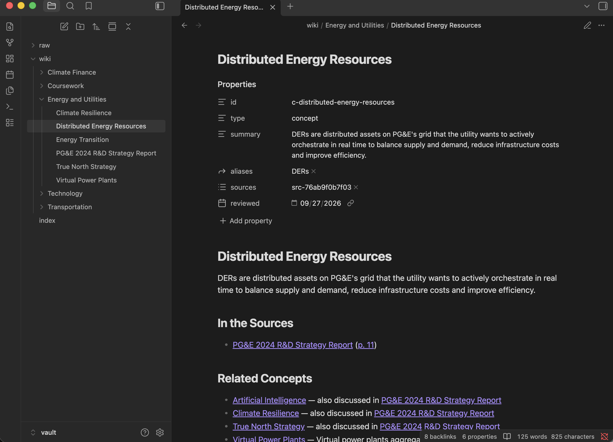
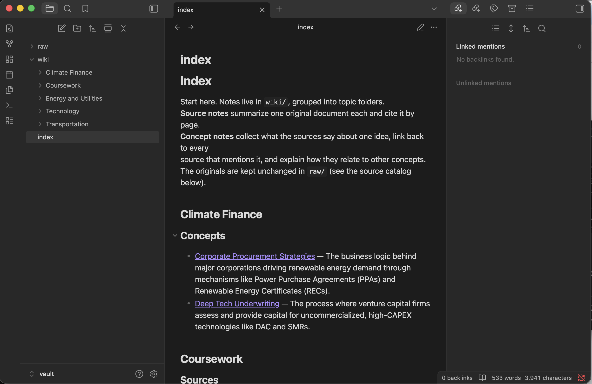
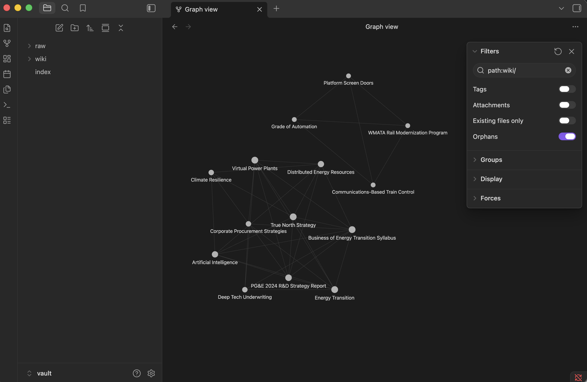
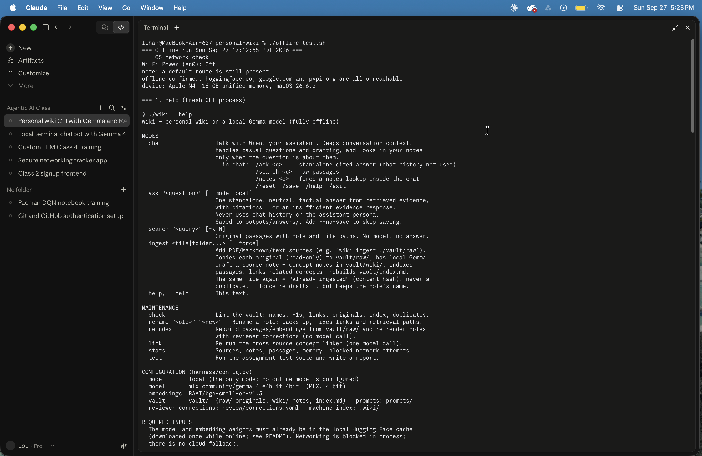
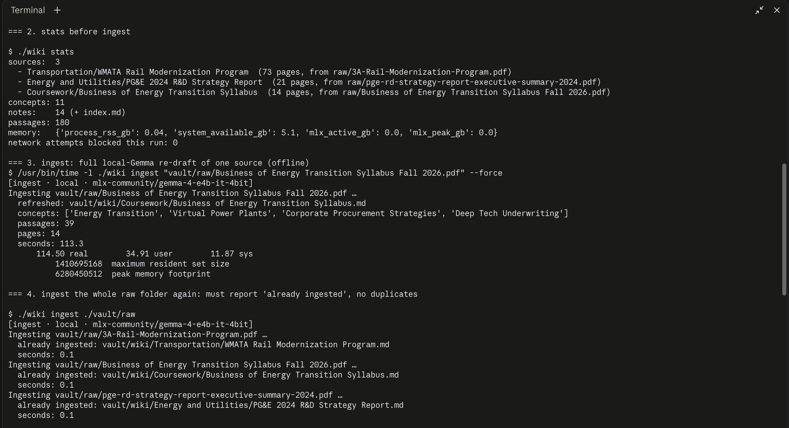
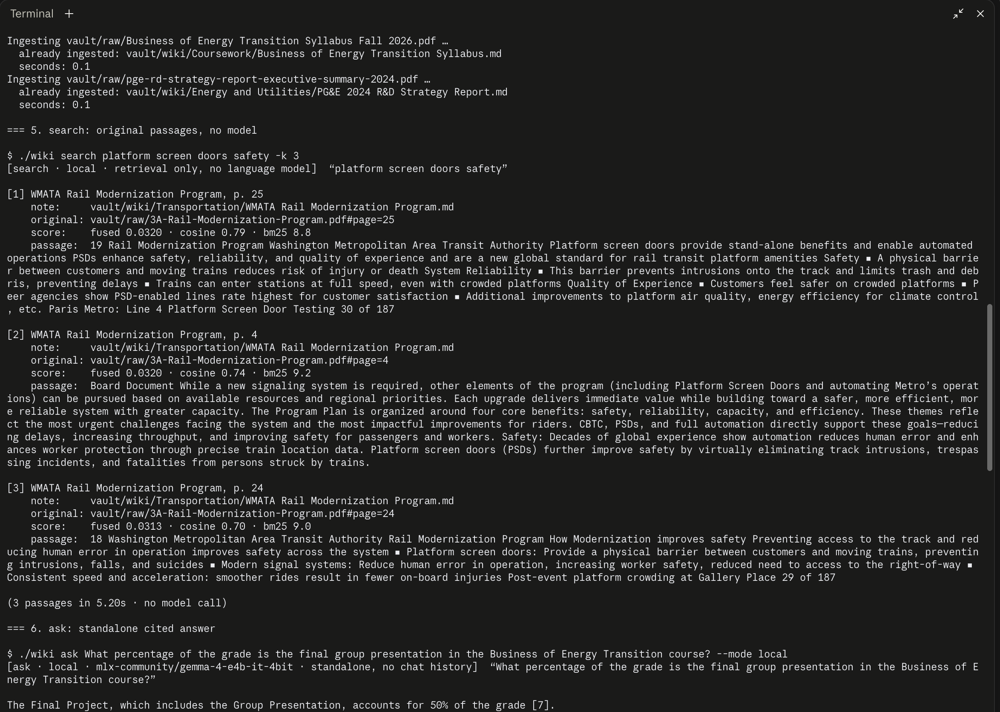
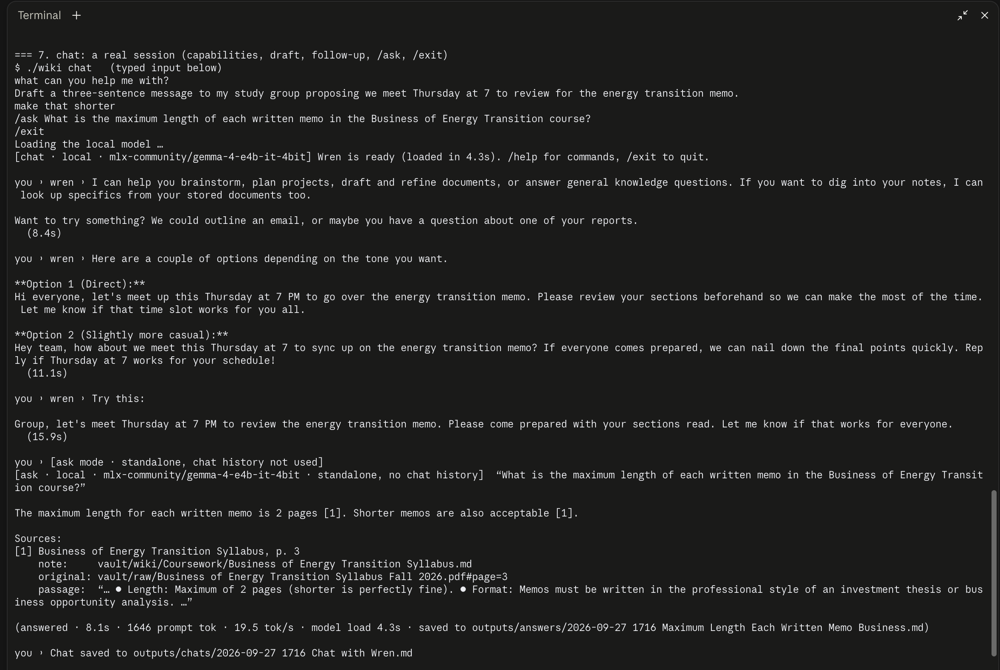
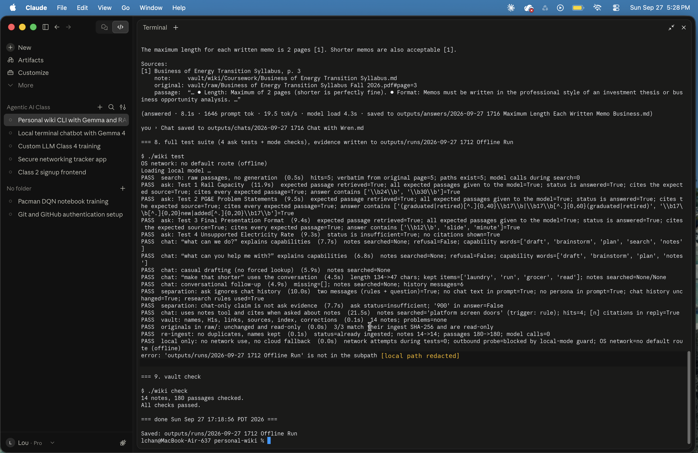

# Personal Wiki CLI — Local Gemma 4 + RAG (Class 5, Assignment 4)

A command-line personal wiki that runs entirely on my laptop. It turns my documents
into an Obsidian wiki for browsing, indexes their original passages for retrieval,
and talks to me through a local **Gemma 4 E4B** model in three modes:

- **chat:** a personal assistant with conversation memory
- **ask:** grounded, cited factual answers
- **search:** raw source passages

The CLI and harness are my own code. Existing libraries handle inference, PDF
parsing and search. No cloud service is used, and there is no fallback to one.

**Jump to:**
[Quick start](#quick-start) ·
[Sources](#purpose-and-sources) ·
[Device and model](#device-model-and-measurements) ·
[Architecture](#architecture-model-retrieval-tool-rag-workflow-harness-cli) ·
[Design choices](#design-choices) ·
[Wiki in Obsidian](#the-wiki-in-obsidian) ·
[Evidence](#evidence) ·
[Reflection](#reflection-real-failures-and-what-i-changed)

---

## Quick start

```bash
./wiki --help                                   # modes, configuration, required inputs
./wiki ingest ./vault/raw                       # ingest every source in the folder
./wiki ingest ~/Downloads/some-report.pdf       # add one source (copied into vault/raw/)
./wiki search "platform screen doors safety"    # original passages + paths, no model
./wiki ask "How many trains per hour could automation allow?" --mode local
./wiki chat                                     # Wren; inside: /ask /search /notes /reset /save /exit
./wiki check                                    # lint names, links, sources, index, corrections
./wiki test                                     # 4 ask tests + mode checks -> outputs/runs/
./offline_test.sh                               # the offline acceptance run (Wi-Fi off first)
```

Maintenance commands:
- `./wiki rename "Old" "New"`: safe rename; fixes links and retrieval paths
- `./wiki reindex`: rebuild the index without a model call
- `./wiki link`: re-run the concept linker
- `./wiki stats`

### Setup (exact steps used)

```bash
# 1. runtime + libraries (venv lives outside Google Drive)
python3 -m venv ~/.venvs/personal-wiki
~/.venvs/personal-wiki/bin/pip install mlx-lm pymupdf rank-bm25 sentence-transformers pyyaml psutil

# 2. while ONLINE: download the model and the embedding model into ~/.cache/huggingface
~/.venvs/personal-wiki/bin/hf download mlx-community/gemma-4-e4b-it-4bit
~/.venvs/personal-wiki/bin/python -c "from sentence_transformers import SentenceTransformer as S; S('BAAI/bge-small-en-v1.5')"

# 3. run
./wiki --help
```

`./wiki` is a two-line zsh launcher that runs `wiki_cli.py` with that venv. Model
weights are not in this repository. They come from the official Hugging Face repos:
- [`mlx-community/gemma-4-e4b-it-4bit`](https://huggingface.co/mlx-community/gemma-4-e4b-it-4bit),
  revision `475b9088d29754a3379866cf5aeb6b41acd313c2`. This is an MLX conversion of
  Google's [Gemma 4 E4B instruction-tuned](https://ai.google.dev/gemma/docs/core) model.
- [`BAAI/bge-small-en-v1.5`](https://huggingface.co/BAAI/bge-small-en-v1.5), revision
  `5c38ec7c405ec4b44b94cc5a9bb96e735b38267a`.

After the one-time download, everything runs offline.

---

## Purpose and sources

The wiki is a small research notebook for my interest in **energy and
infrastructure transitions**: how a transit agency, a utility and an MBA course
each approach modernization. It should answer factual questions about these
documents (numbers, requirements, plans) with page citations.

| Source (unchanged, `vault/raw/`) | What it is | Pages | Wiki source note |
|---|---|---|---|
| `3A-Rail-Modernization-Program.pdf` | WMATA Finance & Capital Committee item, Dec 11 2025 (public board document) | 73 | [WMATA Rail Modernization Program](<vault/wiki/Transportation/WMATA Rail Modernization Program.md>) |
| `pge-rd-strategy-report-executive-summary-2024.pdf` | PG&E 2024 R&D Strategy Report, executive summary (public) | 21 | [PG&E 2024 R&D Strategy Report](<vault/wiki/Energy and Utilities/PG&E 2024 R&D Strategy Report.md>) |
| `Business of Energy Transition Syllabus Fall 2026.pdf` | Haas MBA292T.8 course syllabus (published on bCourses) | 14 | [Business of Energy Transition Syllabus](<vault/wiki/Coursework/Business of Energy Transition Syllabus.md>) |

**How originals connect to pages.** Each source's identity is its SHA-256
(`src-<first 12 hex>`). The source note stores the following in its properties:
- `original: raw/<file>`
- `original_path` (where it was ingested from, as `~/…`)
- `sha256`
- `pages`
- `reviewed`

Every key point links to the exact page (`[[file.pdf#page=4|p. 4]]`), and Obsidian
opens the PDF at that page. Concept notes link back to each source that discusses
them. The **source catalog** at the bottom of [`vault/index.md`](vault/index.md)
lists every source note with its original file.

---

## Device, model and measurements

### Device (measured with `sw_vers`, `sysctl`, `vm_stat`, `df`)

| | |
|---|---|
| Computer | MacBook Air, **Apple M4** (10-core CPU, 10-core GPU, Metal 4) |
| OS | macOS 26.6.2 (Darwin 25.6.0) |
| Memory | **16 GB unified** (CPU and GPU share it; no discrete GPU / dedicated VRAM) |
| Available memory | ~8 GB free at setup (`memory_pressure`: 50%); 2.5–5.5 GB available during runs with my usual apps open |
| Free disk | 255 GB at setup (246 GB now) |

### Model and runtime

| | |
|---|---|
| Model | **Gemma 4 E4B instruction-tuned**, `mlx-community/gemma-4-e4b-it-4bit` (`model_type: gemma4`, 128K context) |
| Quantization | **4-bit affine, group size 64** (MLX), 5.15 GB weights file |
| Runtime | **MLX 0.32.2 / mlx-lm 0.31.3** on the Apple GPU (Metal), Python 3.14.7 |
| Embeddings | `BAAI/bge-small-en-v1.5` (33M params, 134 MB), sentence-transformers 6.1.0 / torch 2.14.0, CPU |
| Other libraries | PyMuPDF 1.28.2 (PDF text), rank-bm25 0.2.2, PyYAML 6.0.3, psutil 7.2.2, numpy 2.5.3 |

### Why E4B at 4-bit

- **E2B** (~2B effective parameters): about 2.9 GB to load at Q4_0 (3.3 GB for the
  MLX 4-bit file I had from Class 4). Fastest, but weakest at following grounding and
  citation rules.
- **E4B** (~4B effective, plus per-layer embedding tables): about 4.5 GB at Q4_0. Here
  it measures **5.15 GB peak MLX memory, 4.2 GB resident**. That leaves room for the
  OS, the embedder and my other apps on a 16 GB Mac, and in testing it followed
  "cite or refuse" instructions reliably. **Chosen.**
- **26B A4B MoE**: only about 4B parameters are *active* per token, but fast inference
  still has to hold all 26B weights in memory: about 14.4 GB at Q4_0. macOS gives the
  GPU only about two-thirds to three-quarters of 16 GB, and I have 2.5–5.5 GB
  available in practice. It does not fit. Active parameters set the speed; total
  parameters set the memory.

E4B is the smallest model that did the job on my wiki. I didn't need to test all
three sizes.

### Measured memory and response time (my wiki, this Mac)

Every run logs these to [`outputs/logs/runs.jsonl`](outputs/logs/runs.jsonl). The
test reports repeat them.

| Operation | Time | Memory |
|---|---|---|
| Model load (from local cache) | 4.4–6.6 s | 4.2 GB MLX active after load |
| **Ingest** rail plan (73 pages → 93 passages, note draft + concepts) | **151 s** | **5.15 GB** MLX peak |
| Ingest PG&E report (21 pages → 48 passages) | 122 s | 5.15 GB MLX peak |
| Ingest syllabus (14 pages → 39 passages), incl. concept-linking call | 121–129 s online; **113 s offline** | 5.15 GB MLX peak; **6.28 GB** macOS peak footprint (`/usr/bin/time -l`, offline) |
| **Ask** (retrieve + generate, ~1,650–2,000 prompt tokens) | **9–14 s** (retrieval 0.02–0.35 s); offline run 9.3–11.9 s | 4.9 GB MLX peak |
| Generation speed | 15–20 tokens/s | |
| Search (no model) | 0.5 s warm; ~5 s cold (the embedder loads) | ~0.4 GB process |
| Chat turn | 4–12 s; 20–25 s when it searches the notes (two model calls) | 4.9 GB MLX peak |

---

## Architecture: model, retrieval tool, RAG workflow, harness, CLI

| Piece | Where | What it is |
|---|---|---|
| **Model** | `harness/llm.py` | Gemma 4 E4B via mlx-lm. It generates text only from the messages the harness gives it: it reads no files, remembers nothing between calls, and runs no tools. `llm.py` applies Gemma's chat template (thinking disabled), streams tokens, strips leaked reasoning blocks, and records tokens/s and peak memory. |
| **Retrieval tool** | `harness/retrieval.py` | Query → ranked **original passages** with note path, original file and page. BM25 (exact words, numbers, acronyms) + bge-small cosine similarity (paraphrases), merged with reciprocal-rank fusion. It generates nothing. `wiki search` shows its results directly. |
| **RAG workflow** | `harness/rag.py` | Used by ask: retrieve 6 passages → gate (refuse if no passage has cosine ≥ 0.55) → add same-page neighbors of the top 3 → prompt = research rules + numbered passages → Gemma → **citation check** (every `[n]` must map to a supplied passage; no valid citation means the answer is withheld as insufficient). RAG adds context at answer time; it does not train the model. |
| **Harness** | `harness/core.py`, `harness/chat.py`, `harness/ingest.py`, `harness/vault.py`, `harness/linker.py`, `harness/offline.py` | Chooses the mode; loads that mode's instruction file; decides the context (chat history only in chat, evidence only in ask); decides when retrieval runs; builds prompts; calls Gemma; checks and renders citations; handles errors; saves outputs and metrics; enforces local-only networking. |
| **CLI** | `wiki`, `wiki_cli.py` | The terminal interface: argparse commands, printing, the interactive chat loop and its slash commands. |

### One command traced through the code: `./wiki ask "…" --mode local`

1. `wiki` (zsh) runs `wiki_cli.py` in the venv. The first thing it does is
   `enforce_local()` (`harness/offline.py`): it sets the Hugging Face offline flags
   and replaces socket connect/DNS so that any non-loopback connection raises
   `NetworkBlocked`.
2. `main()` parses `ask`. `--mode online` is rejected ("not configured"). It builds
   `Harness()`, which loads `.wiki/chunks.jsonl` and `.wiki/embeddings.npy` into
   `ChunkStore`.
3. `cmd_ask` prints the mode header and calls `Harness.ask` → `rag.ask`:
   - **Retrieve:** `ChunkStore.search` scores all 180 passages with BM25 and with
     the question's bge embedding, fuses the two rankings, and takes the top 6.
   - **Gate:** if the best cosine is below 0.55, it returns *insufficient evidence*
     without calling the model.
   - **Expand:** `expand_with_neighbors` adds the adjacent passage on the same page
     for the top 3 hits.
   - **Prompt:** exactly two messages. The system message is
     `prompts/research_rules.md`; the user message is the question plus numbered
     passages labelled "(Note title, p. N)". No persona, no chat history.
   - **Generate:** `LocalLLM.generate` loads Gemma if needed, applies the chat
     template, runs `mlx_lm.stream_generate` at temperature 0, and cleans the text.
   - **Verify:** `INSUFFICIENT_EVIDENCE` becomes the refusal message. Otherwise
     every `[n]` is checked against the passages; invalid numbers are removed, and
     if none remain the answer is withheld.
4. `Harness.ask` logs timings, tokens, citations and memory to
   `outputs/logs/runs.jsonl`, and saves an answer card to
   `outputs/answers/<date> <short title>.md`.
5. `cmd_ask` prints the answer, then for each citation: note path,
   `vault/raw/<file>#page=N`, and the supporting sentence.

**Chat** (`harness/chat.py`) differs in each of those steps:
- The system prompt is `prompts/assistant.md` (Wren's persona and real
  capabilities) plus `prompts/chat_tools.md` (the notes tool and a live list of
  sources).
- Recent history is included, trimmed to about 12,000 characters.
- **Retrieval happens only when needed.** The harness searches automatically when
  the message refers to "my notes / documents / sources…". Otherwise the model
  decides: it can reply with a single line `<<search: query>>`. The harness then
  runs the retrieval tool, sends back numbered passages, and the model answers
  citing `[n]`.
- A stream gate hides tool calls and leaked reasoning from the user.
- `/ask` inside chat calls exactly the same stateless `rag.ask` above. Nothing
  from the chat is passed in, and nothing is added back to the chat history.

**Errors:** a missing file, unsupported type, scanned PDF (no text), unavailable
model (with the `hf download` hint), invalid note name, name clash, or a corrupted
index each end in a one-line `error: …` message and a non-zero exit code.

---

## Design choices

- **Passages:** about 900 characters, sentence-aligned, **never crossing a page
  boundary**, so every passage has exactly one page number. There is a one-sentence
  overlap. That gives 180 passages for the three sources, stored in `.wiki/`
  outside the vault.
- **How much text reaches Gemma:**
  - **Ask:** 6 retrieved passages plus up to 3 same-page neighbors, about
    1,650–2,000 prompt tokens.
  - **Chat:** the persona, the tool instructions, up to 12,000 characters of
    history, and 4 passages when it searches.
  - **Ingest:** the note writer sees at most 36,000 characters per document. That
    is spread evenly across pages, so a 73-page deck contributes about 490
    characters per page.
  - The whole wiki is never sent.
- **Retrieval method:** local hybrid search. BM25 catches "CBTC", "67" and "2030";
  embeddings catch paraphrases like "retired as solved" for "graduated". No hosted
  embeddings.
- **Research rules** (`prompts/research_rules.md`): use only the evidence; cite every
  factual sentence; reply `INSUFFICIENT_EVIDENCE: …` when the evidence is missing;
  answer partial questions partially; neutral register; 1–4 sentences; copy numbers
  exactly. Temperature 0.
- **Assistant personality** (`prompts/assistant.md`): Wren is warm, quick and a
  little wry. The prompt lists what Wren can actually do and the chat commands.
  Its honesty rules: never invent personal facts, label suggestions as
  suggestions, cite notes, and never claim to save anything (there is no memory
  feature; `/save` writes a transcript to `outputs/chats/`). Temperature 0.7.
  These instructions are kept in a separate file from the research rules and are
  never mixed into the same prompt.
- **Note naming and folders:**
  - Filename = H1 = link text: a 2–6 word noun phrase such as *Platform Screen
    Doors*.
  - The harness rejects titles the model proposes if they are hash-like, name an
    export or download task, read as sentences, or look like slugs.
  - Fallback order: the model's title, then the PDF's embedded title, then the
    cleaned filename (which also drops agenda codes like "3A").
  - Name clashes get a meaningful qualifier, never a random suffix.
  - Topic folders under `wiki/`: Transportation, Energy and Utilities, Climate
    Finance, Coursework, Technology.
- **Source IDs → readable pages:** machine IDs (`src-…`, `c-…`) live only in
  properties and in `.wiki/notes.json`. `wiki check` fails if an ID appears in a
  name or note body.
- **Re-ingestion without duplicates:** the content hash identifies a source, so
  the same file again returns `already ingested` with no model call.
  - Renames and moves made in Obsidian are adopted (matched by `id`) rather than
    reverted.
  - `--force` re-drafts the content but keeps the note's current name and folder,
    and prunes concepts the new draft dropped.
  - Text under `## My Notes` is always preserved.
- **Reviewed corrections:** I checked every generated summary, key point and
  definition against the original page and fixed errors in
  [`review/corrections.yaml`](review/corrections.yaml). Each fix records its reason
  and is re-applied on every render, so a re-ingest can't bring an error back, and
  `wiki check` flags any correction that no longer matches. The evidence in
  `raw/` is never edited.
- **Links between notes:**
  - Concepts from the same source link as "also discussed in [[Source]]".
  - Cross-source links come from `wiki link`: the harness picks candidate concept
    pairs from *different* sources by embedding similarity, Gemma judges each one
    and writes a one-sentence reason, and I reviewed the results (see the reflection
    below).
  - Source notes list related sources with the reason.
  - The rail plan has no genuine overlap with the energy sources, so it stays its
    own cluster instead of getting a forced link.
- **Model settings that affected results:**
  - `enable_thinking=False` still occasionally lets Gemma 4 emit a
    `<|channel>thought…` block. It's now stripped.
  - Temperature 0 for ask and ingest makes drafts reproducible: two forced
    re-drafts of the syllabus produced an identical note.

---

## The wiki in Obsidian

Open **`vault/`** itself as the vault, not the repository.

```
vault/
  index.md                         landing page: topics → sources/concepts + source catalog
  raw/                             3 original PDFs, read-only, SHA-256 checked
  wiki/
    Transportation/                WMATA Rail Modernization Program, Communications-Based Train Control,
                                   Platform Screen Doors, Grade of Automation
    Energy and Utilities/          PG&E 2024 R&D Strategy Report, True North Strategy, Climate Resilience,
                                   Distributed Energy Resources, Virtual Power Plants, Energy Transition
    Climate Finance/               Corporate Procurement Strategies, Deep Tech Underwriting
    Coursework/                    Business of Energy Transition Syllabus
    Technology/                    Artificial Intelligence
```

Everything machine-only stays outside the vault: code, prompts, the retrieval
index (`.wiki/`), reviewer corrections (`review/`), tests, answers and logs.

**Screenshots** (graph filter used: `path:wiki/`, Attachments off):

| | |
|---|---|
| Open note with source references and related links |  |
| Page list and index |  |
| Graph view, filter `path:wiki/`, attachments hidden |  |

**Trace example:**
1. `index.md` → *Energy and Utilities* → [[Distributed Energy Resources]].
2. Its *Related Concepts* lists [[Virtual Power Plants]]: "Virtual power plants
   aggregate distributed energy resources…".
3. That note's *In the Sources* links to [[Business of Energy Transition Syllabus]]
   at p. 9, which opens `raw/Business of Energy Transition Syllabus Fall 2026.pdf`
   at page 9, where the course describes VPPs.

`./wiki check` verifies that every internal link and source reference resolves.

---

## Evidence

The expected answers were written before the runs, in
[`tests/questions.yaml`](tests/questions.yaml), outside the searchable vault.

### Final offline run (required evidence): 2026-09-27 17:12–17:18, 17/17 passed

Folder: [`outputs/runs/2026-09-27 1712 Offline Run/`](<outputs/runs/2026-09-27 1712 Offline Run/>)
- [Terminal Log](<outputs/runs/2026-09-27 1712 Offline Run/Terminal Log.txt>)
- [Test Report](<outputs/runs/2026-09-27 1712 Offline Run/Test Report.md>)
- [Mode Checks](<outputs/runs/2026-09-27 1712 Offline Run/Mode Checks.md>)
- Evidence cards:
  [Test 1](<outputs/runs/2026-09-27 1712 Offline Run/Test 1 - Rail Capacity.md>) ·
  [Test 2](<outputs/runs/2026-09-27 1712 Offline Run/Test 2 - PG&E Problem Statements.md>) ·
  [Test 3](<outputs/runs/2026-09-27 1712 Offline Run/Test 3 - Final Presentation Format.md>) ·
  [Test 4](<outputs/runs/2026-09-27 1712 Offline Run/Test 4 - Unsupported Electricity Rate.md>)

**Setup:** Apple M4, 16 GB, macOS 26.6.2 · `mlx-community/gemma-4-e4b-it-4bit` on mlx-lm 0.31.3 / MLX 0.32.2 ·
local mode · 3 sources, 14 notes, 180 passages.

**Proof of offline execution:**
- Wi-Fi power was Off.
- `huggingface.co`, `google.com` and `pypi.org` were all unreachable.
- The test suite recorded "no default route (offline)".
- The CLI recorded **0 network attempts**, and its outbound probe was blocked by the
  local-mode guard.
- The menu-bar Wi-Fi icon shows *off* in screenshots 04 and 08.
- The first line of the log says "a default route is still present": macOS was
  still dropping it at that moment. The reachability checks and the later OS
  check show the Mac was offline.

**What ran, in order, with the CLI started fresh for each command:**

| Step | Result (from the log) |
|---|---|
| `./wiki --help` | help printed |
| `./wiki ingest vault/raw/"Business of Energy Transition Syllabus Fall 2026.pdf" --force` | full local-Gemma re-draft: `refreshed: vault/wiki/Coursework/Business of Energy Transition Syllabus.md`, 4 concepts, 39 passages, **113 s**, **6.28 GB** peak memory footprint |
| `./wiki ingest ./vault/raw` | all 3 sources `already ingested` in 0.1 s each; no duplicates, no model call |
| `./wiki search "platform screen doors safety"` | 3 original passages (rail pp. 25, 4, 24) with note + PDF page paths, "no model call" |
| `./wiki ask "What percentage of the grade is the final group presentation…" --mode local` | "The Final Project, which includes the Group Presentation, accounts for 50% of the grade [7]," citing syllabus p. 4 |
| `./wiki chat` (piped input) | capabilities explained without a search → three-sentence draft → "make that shorter" → shortened version (the conversation was used) → `/ask` memo length: "2 pages [1]," citing p. 3 |
| `./wiki test` | **17/17 PASS** (below) |
| `./wiki check` | all checks passed |

**The four ask tests (offline), with my review of each citation:**

| Test | Retrieval | Actual Gemma answer | Citations checked against the source |
|---|---|---|---|
| 1 Rail capacity | expected p. 4 passage at **rank 1** | "Automation could raise practical capacity limits from 24 to 30 trains per hour or more [1]. Modernization can increase train throughput from 24 trains per hour to 30+ trains per hour [3]. Additionally, new technology allows for 30 trains per hour throughput using existing tunnel infrastructure [7]." | ✅ [1] p. 4 states it verbatim; [3] p. 30 says "from 24 trains per hour to 30+"; [7] p. 51 shows modernization reaching 30 tph on the existing tunnel. All supported. |
| 2 PG&E (paraphrased) | p. 5 at **rank 1**, plus its same-page neighbor | "Of the 67 problem statements from 2023, 17 original problem statements were 'graduated' [1]. In 2024, 17 new problem statements were added [2]." | ✅ Both halves of p. 5; 67 is also on p. 5. Supported. |
| 3 Final presentation | p. 3 at **rank 1** | "The final group presentation requires a 12-slide presentation and has a duration of 12 minutes, followed by an 8-minute Q&A session [1]." | ✅ p. 3: "Format: A 12-slide presentation. Duration: 12 minutes… followed by an 8-minute Q&A". Supported. |
| 4 Unsupported rate | 6 PG&E passages (bills, affordability), no rate | "Insufficient evidence: the retrieved passages do not answer this question. Missing: The evidence does not contain the residential electricity rate in cents per kWh charged by PG&E in 2024." | ✅ Correct refusal; no number was invented and no citations were shown. |

**Mode checks (offline):**
- "what can we do?" and "what can you help me with?" were answered with capabilities,
  with no search and no refusal.
- Casual drafting ran without a lookup.
- "Make that shorter" went from 134 to 47 characters and kept all 4 items.
- The follow-up remembered "Lisbon" and "sister".
- Ask inside a chat got only rules + question; the chat history was unchanged.
- The chat-only claim ("R&D budget $900 million") was refused as insufficient.
- The notes tool was triggered by the harness rule and the reply cited `[n]`.
- Search returned 5 passages, all word-for-word from the original page, with 0 model
  calls.

Also confirmed: the originals are unchanged and read-only (3/3 SHA-256), and
re-ingest made no duplicates.

**Offline memory and speed:**
- Ask: MLX peak 4.91–4.95 GB; 9.3–11.9 s per question at about 19 tokens/s.
- Model load: 4.3–4.7 s.
- The whole suite took 142 s.

**Honest notes on this run:**
- After writing every report and card, `./wiki test` crashed on its final summary
  line, because it tried to make a path relative that was already relative. So the
  command exited with an error even though all 17 checks had passed and been saved.
  That error message printed my local folder path. It's redacted in screenshot 08 and
  in the log (the unredacted copies stay local), and the bug is fixed in
  `tests/run_tests.py`.
- In the piped chat, "make that shorter" produced one tightened three-sentence
  version of the first draft option. It is shorter, but only modestly.

**Offline screenshots:**

| | |
|---|---|
| Network check + help (Wi-Fi off in menu bar) |  |
| Stats, offline ingest, duplicate check |  |
| Search + ask |  |
| Chat session with follow-up and /ask |  |
| Test suite 17/17 + vault check (Wi-Fi off in menu bar) |  |

### The four ask-mode tests

| Test | Question | Expected evidence | Kind |
|---|---|---|---|
| 1 | Trains per hour automation could allow (rail) | rail p. 4: "from 24 to 30 trains per hour or more" | direct, one source |
| 2 | PG&E challenges "retired as solved" and "fresh ones" | PG&E p. 5: "graduated 17", "added 17 new" | paraphrased wording |
| 3 | Slides and minutes for the final presentation | syllabus p. 3: "12-slide presentation… 12 minutes… 8-minute Q&A" | known evidence, source ingested offline |
| 4 | PG&E residential rate in ¢/kWh | none (the report discusses bills, not rates) | unsupported, must refuse |

Each run writes one evidence card per test to `outputs/runs/<run>/Test N - <name>.md`.
A card contains:
- the question and the expected passage
- **all retrieved passages with paths, inspected before the answer**
- the rank of the expected passage
- model and runtime identity, and local mode
- the exact Gemma answer and its citations
- automated checks

### Mode checks

Each run also writes `Mode Checks.md` with the full transcript:
- "what can we do?" and "what can you help me with?": capabilities described, no
  notes search, no refusal
- casual drafting
- a draft followed by "make that shorter"
- a follow-up that remembers earlier context
- ask inside a chat: exactly two prompt messages, with no chat text and no persona
- a chat-only claim ("PG&E's R&D budget was $900 million") that ask then refuses
- chat using the notes tool with citations
- raw search, where passages are verified word-for-word against the original page
  and no model is called

### Earlier runs (kept, including failures)

| Run | Result | What it shows |
|---|---|---|
| [2026-09-26 2314 Online Dry Run](<outputs/runs/2026-09-26 2314 Online Dry Run (before restructure)/Test Report.md>) | 8/12 | First run. Q3 failed as expected (its source wasn't ingested yet); the chat tests crashed on a bug in my code. |
| [2026-09-27 0010 Offline Run (aborted)](<outputs/runs/2026-09-27 0010 Offline Run (aborted, still online)/Terminal Log.txt>) | aborted | The script refused to run: Wi-Fi was off, but a network route remained. |
| [2026-09-27 0016 Offline Run](<outputs/runs/2026-09-27 0016 Offline Run (before restructure)/Terminal Log.txt>) ([report](<outputs/runs/2026-09-27 0016 Offline Run (before restructure)/Test Report.md>)) | 13/13 | First real offline run: fresh CLI, syllabus ingested offline, all tests passed. This was before the required `raw/` + `wiki/` layout, the review and the stricter tests. |
| [2026-09-27 1631 Online Run](<outputs/runs/2026-09-27 1631 Online Run (Test 2 false pass)/Test 2 - PG&E Problem Statements.md>) | 17/17, but one was wrong | **False pass on Test 2** (see the reflection). |
| [2026-09-27 1636 Online Run](<outputs/runs/2026-09-27 1636 Online Run (chat tool-use failure)/Mode Checks.md>) | 16/17 | Chat notes-tool failure: a leaked reasoning block. |
| [2026-09-27 1649 Online Run](<outputs/runs/2026-09-27 1649 Online Run/Test Report.md>) | 17/17 | After the fixes, online. |

Before publishing, I replaced absolute local paths in the two earlier logs with
project-relative or `~/` paths. That was the only edit to evidence files; the code
now writes relative paths itself.

Other saved outputs:
- every ask answer card: [`outputs/answers/`](outputs/answers/)
- chat transcripts: [`outputs/chats/`](outputs/chats/)
- per-command logs with timings and memory: [`outputs/logs/`](outputs/logs/)

---

## Reflection: real failures and what I changed

**1. A fluent, cited answer that was half wrong (Test 2).** The question asked how
many challenges were "retired as solved" *and* how many "fresh ones joined". Gemma
answered *"17 were graduated [1]… two new focus areas were added [1]"*. The second
half is wrong: the source says 17 new problem statements.

- **Cause:** retrieval, not the model. Page 5 was split into two passages. The
  first ("graduated 17") ranked #1. The second ("added 17 new") shares no words with
  "fresh ones joined" and wasn't retrieved, so Gemma answered from the nearest
  "new" thing in the evidence.
- **Why the test didn't catch it:** my automated check only looked for "17"
  somewhere in the answer.
- **Fixes:**
  - Ask now adds the same-page neighbor passages of the top 3 hits
    (`EXPAND_TOP_HITS`).
  - The test now requires *both* numbers, and requires both expected passages to be
    cited.

After the fix: *"17 original problem statements were 'graduated' [1]. In 2024, 17
new problem statements were added [2]"*, citing both halves of p. 5. The failed
run is kept as evidence.

**2. Unreliable tool use in chat.** Gemma sometimes emitted a hidden reasoning block
before its `<<search:…>>` call, or asked permission to search instead of searching
(2 of 3 tries). I now strip the reasoning blocks, and the harness routes messages
that reference "my notes/documents/sources" to retrieval deterministically. The
model still decides for implicit cases.

**3. Generated notes contained small invented details.** The review found:
- the 41% cost cut attributed to "CBTC and platform screen doors"
- "like solar and wind" added to the DER definition
- "critical engagement" as the purpose of the memos
- several wrong page numbers

All are corrected in `review/corrections.yaml` with reasons. The model's
concept-link reasons were also weak: 3 of 4 proposed links were rejected or rewritten.

**Improvement I would try next:** replace neighbor expansion with a small local
cross-encoder reranker over the top ~20 passages, plus page-level context windows.
That would fix split facts in general, not only for adjacent passages. For ingest,
I'd draft long documents section by section (map-reduce) instead of truncating each
page to about 490 characters, which limits what the note writer sees in the 73-page
rail deck.

---

## Optional online mode

Not implemented. `--mode local` is the default and the only mode. `--mode online`
exits with "online mode is not configured". No data leaves the machine.

## Repository layout

```
wiki, wiki_cli.py          CLI launcher + commands
harness/                   config, offline guard, llm, retrieval, rag, chat, ingest, vault, linker, core
prompts/                   assistant.md (persona) · chat_tools.md · research_rules.md · note_writer.md · link_rules.md
review/corrections.yaml    reviewer fixes to generated notes (with reasons)
vault/                     the Obsidian vault (raw/ originals, wiki/ notes, index.md)
.wiki/                     machine index: notes.json, chunks.jsonl, embeddings.npy, backups/
tests/                     questions.yaml (expected evidence) + run_tests.py
outputs/                   runs/ (test reports, evidence cards, mode checks, terminal logs), answers/, chats/, logs/
offline_test.sh            the offline acceptance script
```
